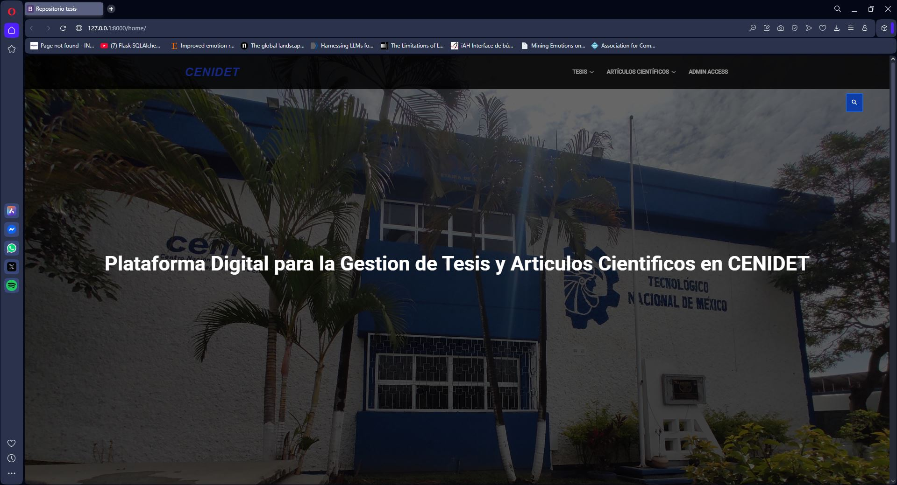
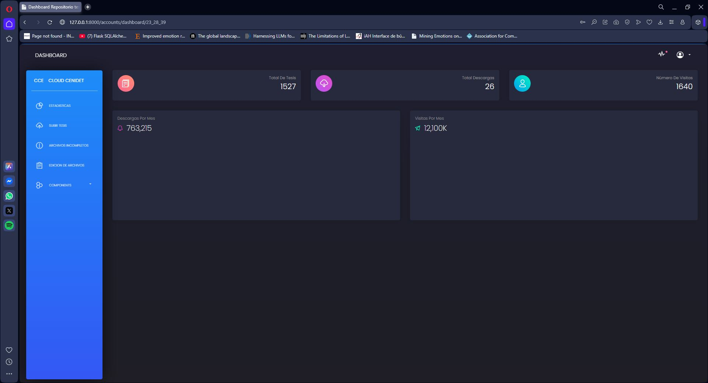
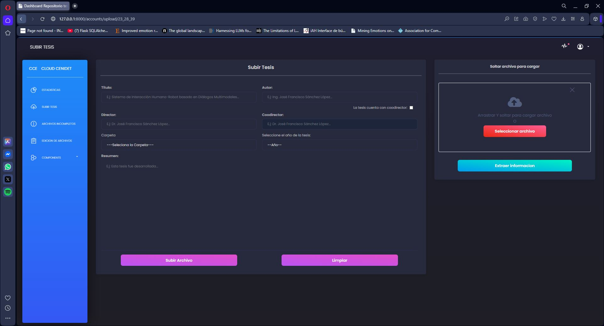
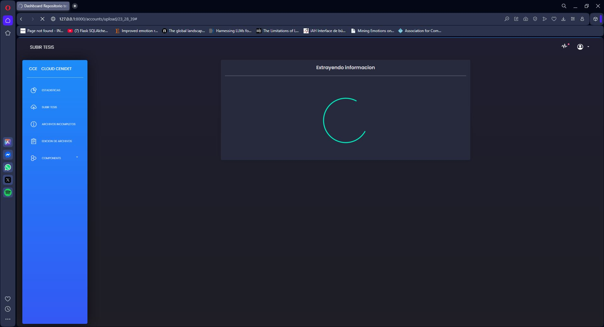
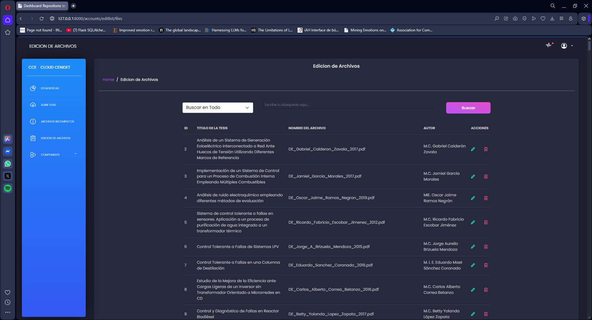
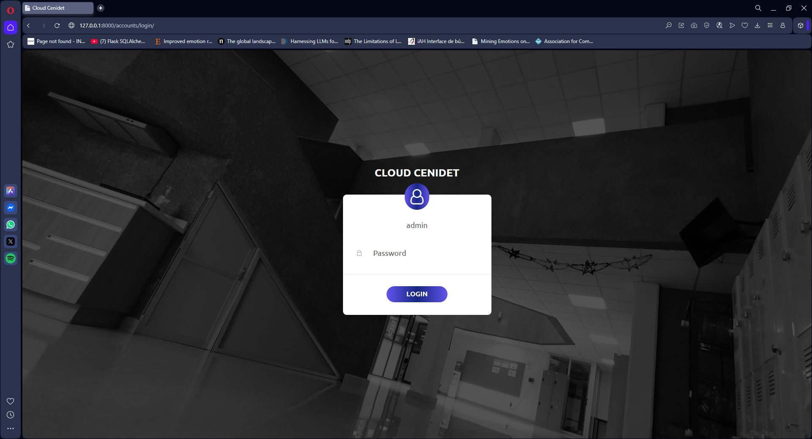
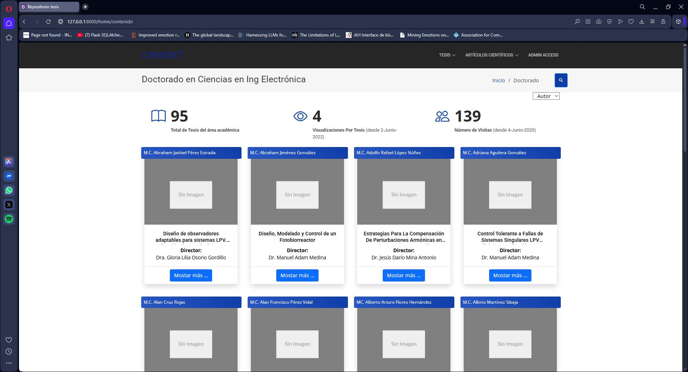

# 📚 Repositorio de Tesis del CENIDET

## 📖 Descripción del Proyecto

Este proyecto es una aplicación web desarrollada con **Django** para la gestión y visualización de un repositorio digital de tesis de **maestría y doctorado**.  

La plataforma permite a los administradores registrar, actualizar y eliminar registros de tesis, incluyendo la carga de los documentos PDF correspondientes.  

Una de las características clave es la integración de un modelo de **Inteligencia Artificial** que, al subir un archivo PDF, extrae automáticamente metadatos relevantes como **título, autor, resumen y director**, agilizando el proceso de catalogación.  

El sistema almacena todos los archivos (PDFs e imágenes de vista previa) de forma **local en el servidor**, garantizando soberanía y control total sobre los datos.

---

## 🚀 Características Principales
- **Gestión Completa de Tesis (CRUD):** Crear, leer, actualizar y eliminar registros.
  
  
  
    
- **Almacenamiento Local de Archivos:** PDFs e imágenes de vista previa en `/media/`.  
- **Extracción de Datos con IA:** Modelo basado en *TensorFlow* y *NLTK*.

  
    
- **Generación Automática de Vistas Previas:** Miniaturas creadas a partir de la portada del PDF.  
- **Panel de Administración:** Interfaz para gestionar registros y realizar búsquedas eficientes.

    
- **Repositorio Público Interactivo:** Navegación, búsqueda y filtrado de tesis.

    
- **Visor de PDF Seguro:** Visualización en pestaña dedicada para evitar conflictos de seguridad.  

---

## 🛠️ Tecnologías Utilizadas
- **Backend:** Python, Django  
- **Base de Datos:** MySQL  
- **Frontend:** HTML, CSS, JavaScript, Bootstrap  
- **Machine Learning / IA:** TensorFlow, NLTK, pdf2image  
- **Manejo de Archivos Estáticos:** Whitenoise  
- **Criptografía:** Cryptography (encriptación de enlaces)  